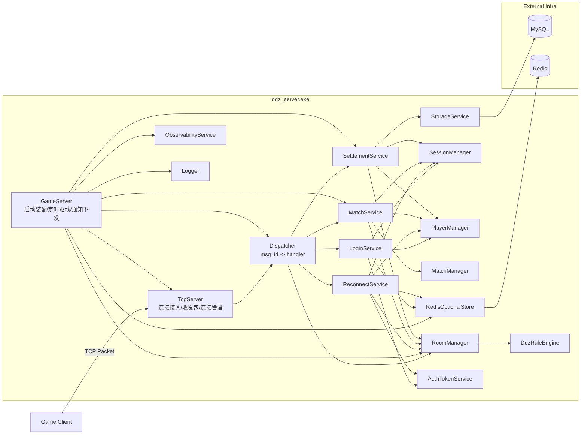
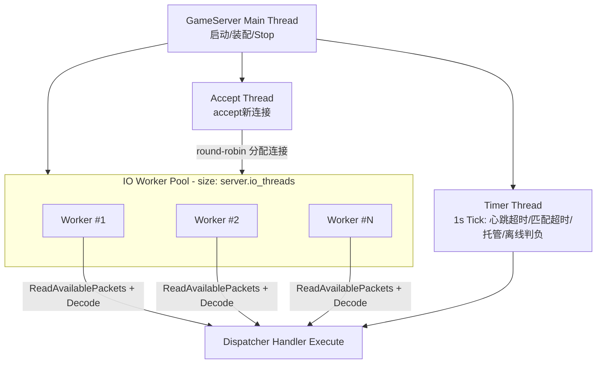
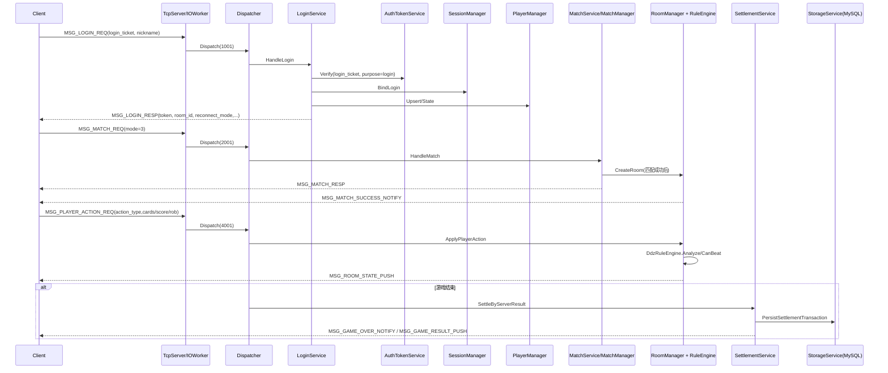
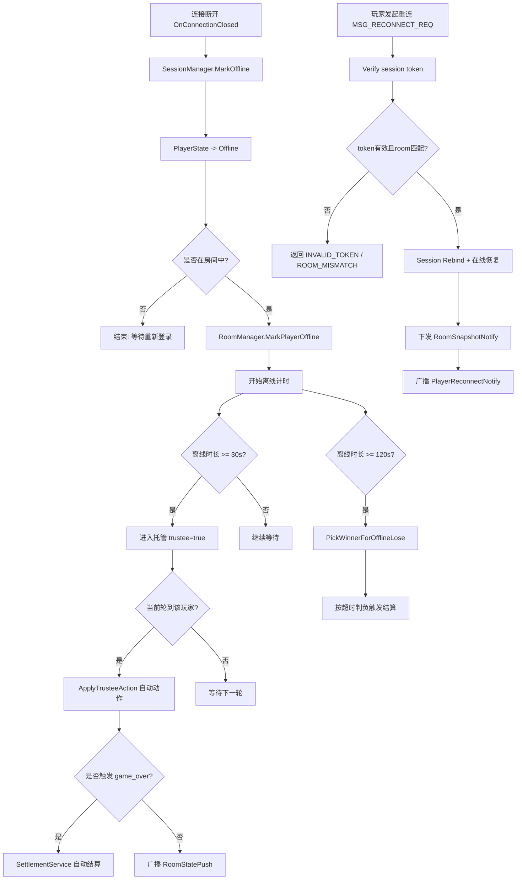

# ddz_server

本目录为 C++ 服务端工程。仓库根目录另有 [`ddz_client/`](../ddz_client)（Vue + Vite H5 客户端）。

斗地主 C++17 服务端工程，采用服务端权威判定与可审计持久化路线。

## 已实现能力

- P0-P3：TCP/协议编解码、消息分发、登录会话、匹配入房、断线重连（强校验 + 快照版本冲突恢复）
- P4：规则引擎（牌型识别/比较）、动作语义校验、服务端自动触发结算
- P6：MySQL DAO 与结算事务、Redis token/session/online 接入
- P5（本次）：可观测埋点、压测脚本、CI 门禁、故障演练测试
- P0 安全收敛：登录改为 `login_ticket` 验签；房间内重复登录按“登录即重连”处理；当前关闭四人场（仅支持 `mode=3`）
- P2 工程改进：网络层改为固定 `io_threads` 线程池模型（不再每连接一线程）；规则引擎新增连对/飞机/四带二等常用牌型识别与比较

## 整体架构

### 1) 组件总览（模块职责与调用关系）



### 2) 线程与执行模型（P2）



### 3) 核心业务链路（登录 -> 匹配 -> 对局 -> 结算）



### 4) 状态与数据边界

- `SessionManager`：连接与 `player_id`、`room_id` 绑定关系与在线状态。
- `PlayerManager`：玩家运行态（Lobby/Matching/InRoom/Playing/Settlement）与内存金币。
- `RoomManager`：房间权威状态机、出牌校验入口、快照生成、离线托管标记。
- `SettlementService + StorageService`：服务端权威结算与事务持久化。
- `RedisOptionalStore`：token/session/online 的可选外部状态存储。
- `ObservabilityService + Logger`：请求结果、耗时、故障与指标快照。

### 5) 异常与恢复路径（断线/重连/托管/离线判负）



## 环境要求

- CMake >= 3.16
- C++17 编译器（Windows 可用 MSVC）
- Docker Desktop（本地 MySQL/Redis）

## 本地运行

```bash
docker compose up -d
cmake -S . -B build
cmake --build build --config Debug
ctest -C Debug --test-dir build --output-on-failure
build/Debug/ddz_server.exe config/dev/server.yaml
```

### H5 网关（P7 第二轮）

网关可执行：`ddz_gateway`（HTTP + WebSocket + 上游 TCP 转发）。

- 默认配置文件：`config/dev/gateway.yaml`
- 默认监听：`0.0.0.0:9010`
- 默认上游：`127.0.0.1:9000`（`ddz_server`）

构建网关（Windows 示例）：

```bash
cmake -S . -B build
cmake --build build --config Debug --target ddz_gateway
```

> 说明：当前 CMake 会优先使用 `BOOST_ROOT`，若未设置则尝试 `D:/Boost/boost_1_88_0`。

启动网关：

```bash
build/Debug/ddz_gateway.exe --config=config/dev/gateway.yaml
```

开发态票据签发接口：

- `POST /api/auth/login-ticket`
- Header: `X-Dev-Key: <gateway.dev_key>`
- Body(JSON): `{"player_id":1001,"nickname":"alice"}`
- Response(JSON): `code/player_id/login_ticket/expire_at_ms/message`

会话续期接口：

- `GET /api/session/refresh?player_id=<pid>&room_id=<rid>`
- Header: `Authorization: Bearer <session_token>`
- Response(JSON): `code/player_id/room_id/token/expire_at_ms/reason/gateway_trace_id/server_trace_id`

WebSocket 接口：

- `WS /ws/game`
- 消息格式：JSON 信封，`body` 保持 KV 文本
- 示例：`{"msg_id":1001,"seq_id":1,"player_id":0,"body":"login_ticket=...;nickname=alice"}`
- 入站可选字段：`h5_request_id`
- 出站附加字段：`h5_request_id/gateway_trace_id/server_trace_id`

网关安全基线：

- 强制 Origin 白名单（HTTP CORS + WS 握手）
- 按 IP 的 HTTP QPS / WS 并发连接限流
- 按连接 WS 消息频率限流并可临时封禁
- 指标快照日志：`event=gateway_metrics_snapshot`

TLS 说明：

- 网关不直接终止 TLS，需由反向代理（Nginx/Caddy）提供 HTTPS/WSS
- 参考 [runbooks/p7_gateway_tls_proxy_runbook.md](runbooks/p7_gateway_tls_proxy_runbook.md)

## 网络模型说明（P2）

- `server.io_threads` 已生效：采用“accept 线程 + 固定 IO worker”模型
- 每个连接由 worker 驱动读包与解包，不再为每个连接单独创建读线程
- 业务消息分发与会话语义保持兼容

## P5 工程化命令

本地门禁：

```powershell
tools/ci/check.ps1 -BuildDir build -Config Debug
```

压测软门槛：

```powershell
tools/perf/run_stress.ps1 -BuildDir build -Config Debug -SoftThresholdEnabled $true
```

故障演练：

```bash
ctest -C Debug --test-dir build -R p5_fault_drills --output-on-failure
```

## 协议说明

包结构：

```text
| packet_len(4) | msg_id(4) | seq_id(4) | player_id(8) | body(N) |
```

`body` 为 KV 文本：`k1=v1;k2=v2`。

关键 P4/P5 消息：

- `4001` `MSG_PLAYER_ACTION_REQ`
- `4002` `MSG_PLAYER_ACTION_RESP`
- `4003` `MSG_ROOM_STATE_PUSH`
- `4004` `MSG_GAME_RESULT_PUSH`
- `4005` `MSG_ROOM_STATE_PUSH_V2`（P7 新增）
- `5001` `MSG_GAME_OVER_NOTIFY`

说明：`5002 MSG_SETTLEMENT_REQ` 已禁止客户端权威结算，服务端只接受内部自动结算链路。

规则引擎当前覆盖牌型（P2 更新）：

- 基础：单张、对子、三张、三带一、三带二、顺子、炸弹、王炸
- 扩展：连对、飞机（不带/带单/带对）、四带二（单/对）

关键 P3 消息：

- `1001` `MSG_LOGIN_REQ`
- `1002` `MSG_LOGIN_RESP`
- `3001` `MSG_ROOM_SNAPSHOT_NOTIFY`
- `3002` `MSG_PRIVATE_HAND_NOTIFY`（P7 新增）
- `3003` `MSG_PLAYER_RECONNECT_NOTIFY`
- `6001` `MSG_RECONNECT_REQ`
- `6002` `MSG_RECONNECT_RESP`
- `6103` `MSG_SESSION_REFRESH_REQ`
- `6104` `MSG_SESSION_REFRESH_RESP`

`MSG_PRIVATE_HAND_NOTIFY` 字段：

- `room_id`
- `player_id`
- `cards`（逗号分隔）
- `card_count`
- `snapshot_version`

`MSG_ROOM_STATE_PUSH_V2` 在 `4003` 基础上新增：

- `last_play_player_id`
- `last_play_cards`
- `player_card_counts`（`pid:cnt,pid:cnt`）
- `landlord_bottom_cards`
- `action_deadline_ms`

`MSG_LOGIN_REQ` 当前字段：

- `login_ticket`（必填，服务端验签与过期校验）
- `nickname`（可选）

`MSG_LOGIN_RESP` 关键字段：

- `code/player_id/nickname/coin/token/expire_at_ms`
- `room_id/reconnect_mode/snapshot_version`

说明：`token` 为会话 token（`session` purpose），用于后续心跳/重连校验。

`MSG_RECONNECT_REQ` 当前字段：

- `player_id`
- `token`（会话 token）
- `room_id`
- `last_snapshot_version`

当客户端版本落后或冲突时，服务端返回 `SNAPSHOT_VERSION_CONFLICT` 并附最新快照，客户端可直接覆盖本地态。

`MSG_SESSION_REFRESH_REQ` 字段：

- `player_id`
- `token`（会话 token）
- `room_id`

`MSG_SESSION_REFRESH_RESP` 字段：

- `code/player_id/room_id/token/expire_at_ms`
- `reason`（失败原因或 `ok`）

兼容性说明：

- 关键响应保持 `code` 不变，并新增 `reason` 字段用于细粒度错误定位（例如 `4002/6002/6104`）。

匹配模式说明：

- 当前仅支持 `mode=3`（三人场）
- `mode=4` 请求会返回 `MATCH_MODE_INVALID`

## P3 离线策略

- 玩家离线 `>=30s`：进入托管（最小可行策略自动动作）
- 玩家离线 `>=120s`：按超时判负触发服务端结算
- 快照包含 `snapshot_version/last_action_seq/players_online_bitmap/trustee_players`

## 配置新增（P5）

```yaml
observability:
  enable_structured_log: true
  metrics_report_interval_ms: 30000

perf:
  soft_threshold_enabled: true
```

CI：`.github/workflows/ci.yml`（Ubuntu + Windows + macOS，build + ctest + perf soft gate；Docker 容器仅在 Linux runner 上启动）。
